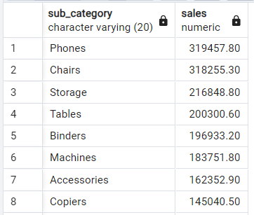
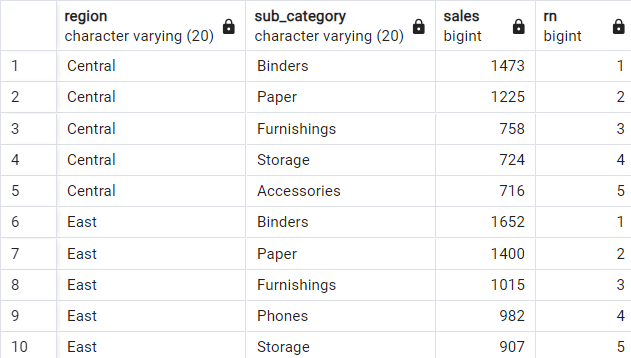
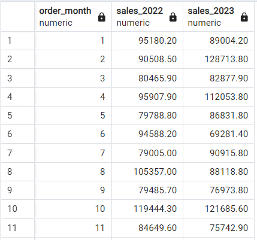
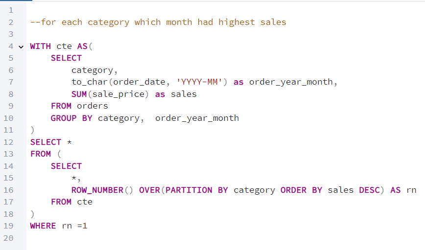
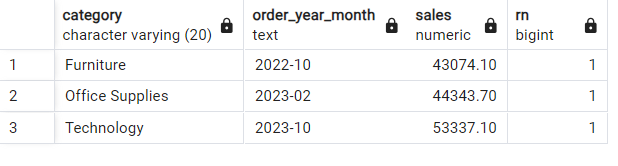
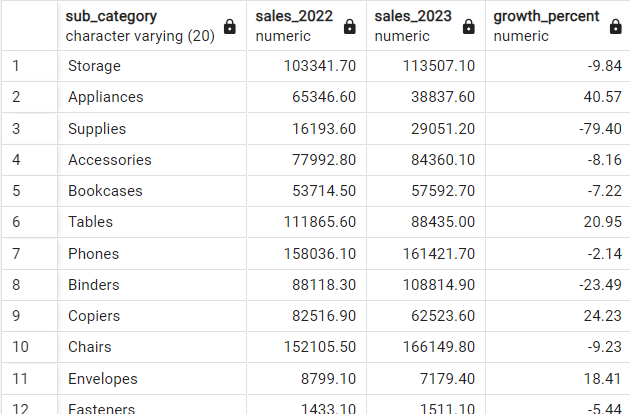

# Global-Mart-Sales-Insights-2022-2023-Analysis
The Global Mart Sales Insights: 2022-2023 Analysis project focuses on uncovering trends and insights from global sales data spanning 2022 and 2023. Using Python for data preprocessing and visualization, combined with SQL in PostgreSQL for advanced querying, this project delves into key sales metrics, patterns, and performance analysis. The objective is to leverage data-driven approaches to identify opportunities, evaluate year-over-year growth, and highlight regional or product-level trends, providing actionable insights for decision-making.

### Query 1

##### Ouput: 

### Query 2

##### Ouput: 

### Query 3

##### Ouput: 

### Query 4

##### Ouput: 

### Query 5

##### Ouput: 

